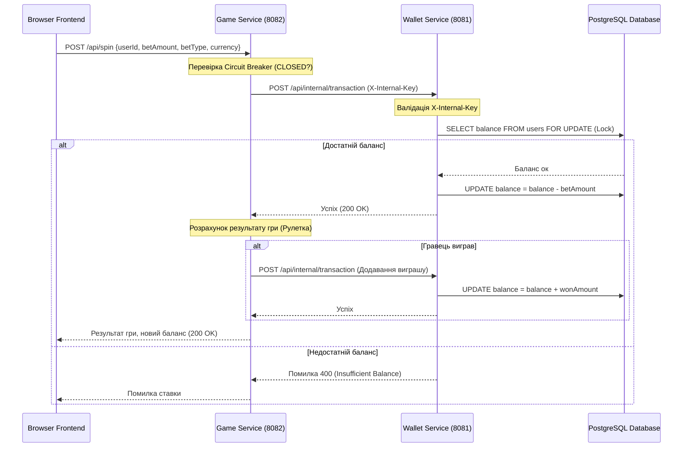

# 🛠️ Технічна документація: Внутрішній устрій та Залежності

Цей посібник містить вичерпний технічний опис внутрішньої механіки платформи, логіки взаємодії файлів, алгоритмів транзакцій та переліку всіх системних залежностей.

---

## 📋 1. Системні Залежності (Dependencies)

Для збірки, запуску та тестування проекту необхідні такі зовнішні бібліотеки та інструменти. Залежності поділено на системні вимоги та C++ бібліотеки.

### 💻 Системні Вимоги:
* **Компілятор C++**: підтримка стандарту **C++20** або новішої версії (`GCC >= 11`, `Clang >= 13` або `MSVC >= 19.29`).
* **CMake**: інструмент конфігурації збірки версії `CMake >= 3.14`.
* **Docker & Docker Compose**: для оркестрації та запуску всієї інфраструктури в контейнерах.
* **OpenSSL**: системна бібліотека для криптографічних операцій (використовується в JWT).

### 📚 Зовнішні C++ Бібліотеки:

| Бібліотека | Опис | Тип інтеграції | Призначення |
| :--- | :--- | :--- | :--- |
| **OpenSSL (libssl & libcrypto)** | Криптографічний стандарт | Системна лінковка | Розрахунок HMAC-SHA256 та кодування Base64 |
| **pqxx (libpqxx)** | C++ клієнт для PostgreSQL | Системна лінковка | Виконання безпечних транзакцій до бази даних |
| **libpq** | Низькорівневий драйвер Postgres | Системна лінковка | Комунікація з PostgreSQL |
| **nlohmann_json** | JSON parser | CMake FetchContent | Робота з JSON-пакетами запитів та відповідей |
| **cpp-httplib** | Легковагий HTTP-сервер | CMake FetchContent | Обробка HTTP REST-запитів мікросервісів |
| **spdlog** | Швидкий структурований логер | Системна лінковка | Логування подій, транзакцій та збоїв |
| **GoogleTest (gtest)** | Тестовий фреймворк | CMake FetchContent | Юніт-тестування логіки та стійкості до відмов |

---

## ⚙️ 2. Технічний опис роботи файлів

Код розділено на заголовні файли архітектурних інтерфейсів (`include/`) та логічні виконувані сервіси (`src/`).

```
CasinoPlatform/
├── include/
│   ├── JwtHelper.hpp         <-- Криптографія токенів (OpenSSL)
│   ├── CircuitBreaker.hpp    <-- Стан машини запобігання відмовам
│   ├── BlackjackEngine.hpp   <-- Логіка та підрахунок очок Блекджеку
│   ├── RouletteEngine.hpp    <-- Розрахунок ставок та виплат Рулетки
│   ├── DesignPatterns.hpp    <-- Шаблони Strategy, Decorator, Factory
│   ├── IoCContainer.hpp      <-- Автозбірка системи та інжекція залежностей
│   ├── IDatabase.hpp         <-- Інтерфейс репозиторію збереження даних
│   └── PostgresDatabase.hpp  <-- Конкретна реалізація PostgreSQL (pqxx)
├── src/
│   ├── wallet_service.cpp    <-- REST API: фінанси, сесії, токени
│   └── game_service.cpp      <-- REST API: Slots, Roulette, Blackjack
```

### 🔐 2.1. Криптографія JWT — `include/JwtHelper.hpp`
* **Як працює**: 
  1. `generate_jwt(...)`: Формує JSON-заголовки та payload (ідентифікатор користувача, пошта, час закінчення токена `exp`). Конвертує їх у рядок за допомогою `nlohmann::json`.
  2. `base64url_encode(...)`: Кодує байти в base64, замінюючи символи `+` на `-`, `/` на `_` та повністю відкидаючи знаки заповнення `=`.
  3. `hmac_sha256(...)`: Викликає функцію `HMAC()` з OpenSSL із алгоритмом хешування `EVP_sha256()` для підпису результуючого рядка за допомогою `JWT_SECRET`.
  4. `verify_jwt(...)`: Розбиває токен по символах крапки (`.`), вираховує очікуваний підпис та порівнює його з підписом у токені. Запобігає атакам підробки сигнатури. Автоматично дописує необхідний padding `=` при виклику декодера.

### 🛡️ 2.2. Запобігання каскадним збоям — `include/CircuitBreaker.hpp`
* **Принцип роботи (State Machine)**:
  * Внутрішній стан контролюється атомарно за допомогою `std::mutex` для повної потокобезпеки у багатопотоковому HTTP-сервері.
  * **CLOSED**: Лічильник невдач `failureCount` дорівнює нулю. Запити дозволені (`allowRequest() -> true`).
  * **OPEN**: Якщо відбулося 3 підряд тайм-аути або відмови з'єднання, виклик `recordFailure()` переводить систему в стан `OPEN`. Запити блокуються миттєво (`allowRequest() -> false`), повертаючи клієнту помилку `503 Service Unavailable`.
  * **HALF-OPEN**: Метод `allowRequest()` перевіряє поточний час: якщо від моменту блокування пройшло більше `10 секунд` (cooldown), стан переходить у `HALF-OPEN` для проведення тестового запиту (зондування). Успіх повертає стан у `CLOSED`, невдача — миттєво повертає в `OPEN`.

### 🃏 2.3. Движок Блекджеку — `include/BlackjackEngine.hpp`
* **Як працює**:
  * Карти зберігаються у структурі `Card` (масть, номінал, базові очки).
  * Метод `calculateScore()` динамічно вираховує сумарний бал руки: Тузи за замовчуванням мають вагу `11` очок. Якщо загальна сума перевищує `21`, вага кожного Туза зменшується на `10` (стає `1`), доки рука не вийде з зони «перебору» (bust).
  * `Deck::draw()` забезпечує автогенерацію нової колоди з 52 карт із псевдовипадковим перемішуванням `std::shuffle` та `std::mt19937`, якщо карти в поточній колоді закінчилися.

### 🎡 2.4. Движок Рулетки — `include/RouletteEngine.hpp`
* **Як працює**:
  * Реалізує об'єктний поліморфізм для обробки ставок. Базовий клас `RouletteBet` декларує інтерфейс `calculatePayout(winningNumber)`.
  * Конкретні класи (`StraightBet`, `ColorBet`, `DozenBet`, `EvenOddBet`) розраховують виграш на основі математичних правил та повертають коефіцієнти (`x36`, `x2`, `x3`).
  * `AdvancedRouletteEngine` акумулює ставки користувача у вектор `std::vector<std::unique_ptr<RouletteBet>>`. При виклику `spin()` генерується випадкове число від `0` до `36`, підраховуються сумарні виплати, а пам'ять під ставки автоматично звільняється очищенням вектора (`bets.clear()`).

---

## 📈 3. Логіка виконання фінансових транзакцій (Bet Flow)

Коли гравець робить ставку в грі (наприклад, запускає Roulette Spin), система проходить такий життєвий цикл:



### Особливості транзакційного циклу:
1. **Блокування балансу**: Для запобігання атакам змагання (Race Conditions), коли користувач робить кілька ставок одночасно, запити до PostgreSQL використовують семантику транзакцій `SELECT FOR UPDATE` для блокування рядка користувача до завершення зняття коштів.
2. **Гарантія виплат**: Списання ставки відбувається **до** розрахунку результату гри. Якщо гравець виграв, Wallet Service робить другу внутрішню транзакцію для зарахування виграшу.
3. **Захист лінії зв'язку**: Якщо на кроці запиту до Wallet Service стається збій з'єднання, Game Service фіксує помилку в `CircuitBreaker`.
