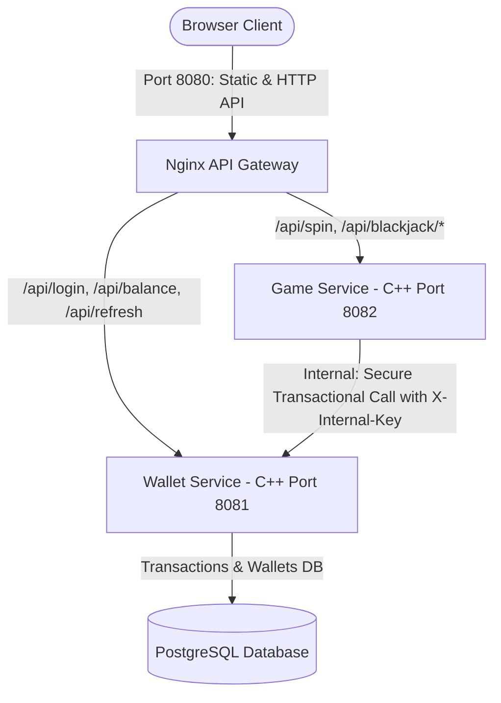

# 🎰 Premium Casino Platform — Архітектура, Шаблони та Безпека

Цей репозиторій містить сучасну, високопродуктивну мікросервісну платформу для онлайн-казино, розроблену на **C++20** з використанням передових об'єктно-орієнтованих принципів (OOP), шаблонів проектування (Design Patterns), стійкості до відмов (Fault Tolerance) та криптографічної безпеки.

---

## 🧭 Загальна архітектура системи

Платформа спроектована як децентралізована екосистема мікросервісів, що взаємодіють між собою через внутрішній REST API та координуються єдиним шлюзом.



### Компоненти системи:
1. **API Gateway (Nginx)**: Єдина точка входу (`port 8080`). Роздає статичний HTML/JS-клієнт та перенаправляє запити на відповідні мікросервіси.
2. **Wallet Service (Port 8081)**: Сервіс керування рахунками, транзакціями та авторизацією. Використовує базу даних **PostgreSQL** та випускає криптографічні JWT-токени.
3. **Game Service (Port 8082)**: Движок ігор (Слоти, Рулетка, Блекджек). Розраховує результати та звертається до Wallet Service для списання ставок/зарахування виграшів.

---

## 🎨 Шаблони проектування (Design Patterns)

Платформа побудована на гнучкому та розширюваному ООП-дизайні з активним використанням шаблонів GoF:

### 1. Strategy Pattern (Шаблон Стратегія)
* **Де знаходиться**: [include/DesignPatterns.hpp](file:///Users/bars/OOP%20NEW/CasinoPlatform/include/DesignPatterns.hpp) та [include/RouletteEngine.hpp](file:///Users/bars/OOP%20NEW/CasinoPlatform/include/RouletteEngine.hpp)
* **Призначення**: Визначає сімейство алгоритмів виплат для різних типів ставок. Наприклад, `ColorPayoutStrategy` (виплата за колір рулетки `x2`) та `NumberPayoutStrategy` (виплата за точне число `x36`) реалізують інтерфейс виплат динамічно без умовних операторів `if/else`.

### 2. Decorator Pattern (Шаблон Декоратор)
* **Де знаходиться**: [include/DesignPatterns.hpp](file:///Users/bars/OOP%20NEW/CasinoPlatform/include/DesignPatterns.hpp)
* **Призначення**: Динамічно додає нову поведінку до виплат за стратегією. Наприклад, `HappyHourBonusDecorator` огортає базову стратегію виплат та збільшує виграш гравця в `x1.5` рази під час святкових годин, не змінюючи вихідні класи.

### 3. Factory Pattern (Шаблон Фабрика)
* **Де знаходиться**: [include/DesignPatterns.hpp](file:///Users/bars/OOP%20NEW/CasinoPlatform/include/DesignPatterns.hpp) та [include/RouletteEngine.hpp](file:///Users/bars/OOP%20NEW/CasinoPlatform/include/RouletteEngine.hpp)
* **Призначення**: Класи `GameFactory` та `BetFactory` відповідають за створення об'єктів ігор (Рулетка, Слоти, Блекджек) та типів ставок рулетки на основі рядкових параметрів. Це ізолює процес ініціалізації об'єктів від клієнтського коду.

### 4. Dependency Injection & IoC Container
* **Де знаходиться**: [include/IoCContainer.hpp](file:///Users/bars/OOP%20NEW/CasinoPlatform/include/IoCContainer.hpp)
* **Призначення**: Автоматично збирає граф залежностей під час запуску системи. Логер (`SpdLogger`) інжектується в базу даних (`PostgresDatabase`), а сама база інжектується в сервіси.

---

## 🔒 Безпека та Стійкість до відмов (Security & Fault Tolerance)

### 1. Криптографічний движок JWT (HMAC-SHA256)
* Замість вразливого передавання ID користувача в запитах, уся публічна авторизація захищена парою токенів **Access Token (1 година)** та **Refresh Token (7 днів)**.
* Токени підписуються та валідуються нативно в C++ движку за допомогою бібліотеки **OpenSSL EVP** та Base64Url кодування ([include/JwtHelper.hpp](file:///Users/bars/OOP%20NEW/CasinoPlatform/include/JwtHelper.hpp)).

### 2. Захист Внутрішніх транзакцій (`X-Internal-Key`)
* Всі критичні фінансові операції (списання балансу під час ставок, зарахування виграшів) всередині Wallet Service закриті для публічного доступу.
* Внутрішня взаємодія між Game Service та Wallet Service захищена спільним секретним ключем, що передається в HTTP-заголовку `X-Internal-Key`.

### 3. Стійкість до відмов: Circuit Breaker
* **Де знаходиться**: [include/CircuitBreaker.hpp](file:///Users/bars/OOP%20NEW/CasinoPlatform/include/CircuitBreaker.hpp)
* **Призначення**: Запобігає каскадній відмові платформи, якщо Wallet Service стане тимчасово недоступним або перевантаженим.
* **Поведінка**:
  * **CLOSED**: Запити проходять без перешкод.
  * **OPEN**: Після 3 підряд невдалих мережевих запитів Circuit Breaker переходить у відкритий стан і миттєво віддає користувачу помилку `503 Service Unavailable`, не навантажуючи мережу марними спробами.
  * **HALF-OPEN**: Через 10 секунд очікування (cooldown) система дає можливість зробити один тестовий запит для перевірки мережі. Якщо запит успішний — лінія відновлюється (`CLOSED`), якщо ні — знову закривається (`OPEN`).

---

## 🚀 Інструкція із запуску системи

### 1. Налаштування середовища (`.env`)
Створіть файл `.env` у корені проекту на основі шаблону `.env.example`:
```bash
cp .env.example .env
```
Заповніть ваші приватні ключі авторизації:
* `DATABASE_URL` — підключення до бази PostgreSQL.
* `JWT_SECRET` — ваш унікальний довгий ключ підпису JWT-токенів.
* `INTERNAL_API_KEY` — внутрішній ключ доступу мікросервісів.

### 2. Запуск у Docker Compose (Рекомендовано)
Для повного підняття всієї інфраструктури (Postgres + Nginx + 2 C++ мікросервіси) виконайте:
```bash
docker-compose up --build
```
Після успішного старту перейдіть у браузері на: **`http://localhost:8080`**

### 3. Нативний запуск для розробки (C++ CMake)
Для локальної збірки C++ бінарних файлів на вашому ПК:
```bash
mkdir -p build && cd build
cmake ..
make -j4
```
Запуск юніт-тестів:
```bash
./tests/casino_tests
```
Запуск сервісів:
```bash
./wallet_service
# в іншій вкладці терміналу:
./game_service
```

---

## 🧪 Тестова екосистема (33 Юніт-тести)
Ми розробили повне покриття логіки гри та безпеки на базі бібліотеки **GoogleTest**. Тести запускаються автоматично при кожному Pull Request у нашому CI/CD пайплайні GitHub Actions:
* **Тести Блекджеку**: розрахунок очок карт, динамічні Тузи, визначення результатів ігри.
* **Тести Рулетки**: перевірка виплат по стратегіях для всіх типів ставок, робота фабрики ставок.
* **Тести Безпеки**: шифрування/дешифрування JWT, термін дії, перевірка сигнатур.
* **Тести Circuit Breaker**: перевірка логіки переходів станів та таймінгів.
